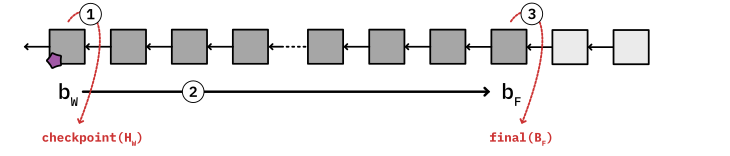
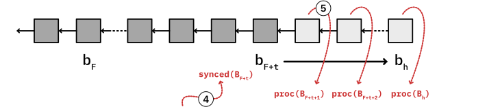
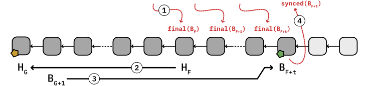

In this document, we present our ideas for implementing chain synchronization on the merged eth1 + eth2 chain.

After the merge event, eth1 and eth2 clients run in tandem. The eth2 client maintains the connection to the beacon chain and performs fork choice. The eth1 client, a.k.a. the 'execution layer', receives block data from the eth2 client, executes/verifies it and maintains the application state.

The interface that eth2 and eth1 use to communicate is uni-directional: all cross-client communication is initiated by eth2, and happens in the form of requests. Eth1 simply responds to each request, but cannot request any information from eth2.

Definitions: In the text below, we refer to beacon chain blocks as bx. We also assume that the beacon chain begins at block bW, a recent checkpoint, which must be a block after the merge event. There is a direct correspondence between beacon chain blocks and block data of the execution layer: for every beacon block bx (for x >= w), a corresponding execution-layer block Bx also exists. Additionally, every execution-layer block Bx contains its block header Hx.

# Sync

## eth2 perspective

This section explains the sync procedure from the eth2 client point-of-view.

When the eth2 client starts, it is initialized with a 'weak subjectivity checkpoint' containing the beacon chain state of a historical block bW. The checkpoint also contains the execution-layer block header HW. On startup, HW is immediately relayed to the eth1 client (1).

To sync, the eth2 client must first process the beacon chain optimistically&#x2014;without accessing application state&#x2014;up to the latest finalized block bF (2). When block bF is reached, the eth2 client starts eth1 sync by providing the execution-layer block BF to the eth1 client (3).

The eth2 client keeps following the beacon chain until the eth1 sync completes, and keeps submitting finalized blocks to the eth1 client. This means it should repeat step (3) for every new finalized block.

The eth1 client sync will usually take quite a bit of time to complete. When the eth1 client signals that it is done (4), the beacon chain will have advanced by t blocks to the latest finalized block bF+t. The application state of BF+t is now available and the eth2 client can perform additional cross-validation against this state. For example, it could read the deposit contract here.

The eth2 client should now submit the execution-layer block data of all non-finalized beacon blocks to the eth1 client for processing (5). The sync procedure completes when the current head block bH is reached.

## eth1 perspective

Upon startup, the eth1 client first waits for a checkpoint header HW from the eth2 client.

Sync begins when the finalized block BF is received (1). This block is assumed to be valid. Furthermore, it is assumed that BF is a descendant of the genesis block BG.

The eth1 client first downloads the chain of block headers down from HF, following parent hashes (2). Headers are written to the database. The header chain must contain the checkpoint header HW, and sync aborts if a different header is encountered at the same block number. This sanity check exists to ensure that the chain is valid without having to sync all the way back to the genesis block.

While the chain is downloading/processing, the eth1 client also receives notifications about newly-finalized blocks in range BF+1&#x2026;BF+t. These blocks must be appended to the database as they are received.

When the genesis header HF is reached, block body data can be downloaded (3). There are two ways to do this:

-   The client can perform 'full sync', downloading blocks and executing their state transitions. This recreates the application state incrementally up to the latest block. Sync is complete when the latest finalized block BF+t has been processed.

-   The client can perform state synchronization by downloading the blocks BG+1&#x2026;BF and their application state without EVM execution. This is expected to be faster than full sync, and is equally secure because the state root of BF was finalized by eth2. The state download can happen concurrently with steps (2) and (3).
    
    The peer-to-peer network can only provide the state of very recent blocks. Since it is expected that the state of BF will gradually become unavailable as the chain advances, the client must occasionally re-target its state sync to a more recent 'pivot block'. Conveniently, the newly-finalized blocks BF+1&#x2026;BF+t received from eth2 can be used for this purpose. You can read more about the pivot block in the [snap sync protocol specification](https://github.com/ethereum/devp2p/blob/master/caps/snap.md#synchronization-algorithm).

After reporting sync completion of BF+t to the eth2 client (4), the execution layer is done and switches to its ordinary mode of operation: individual blocks are received from the eth2 client, the blocks are processed, and their validity reported back to the eth2 client.

## Handling restarts and errors

The above description of sync focuses on a single sync cycle. In order to be robust against failures, and to handle client restarts, clients must be able to perform multiple sync cycles with an initialized database. The interface between eth2 and eth1 is designed to make this possible because it is uni-directional: When eth2 restarts, it can simply perform the usual request sequence and expect that the eth1 client will reset itself to the correct state.

When eth1 receives note of a finalized block BF, there are two possibilities: if the block already exists in the local chain, and its application state is also available, sync isn't necessary. If the finalized block is unknown, the eth1 client should restart sync at step (1), downloading parent headers in reverse. If the block is known but its state is unavailable, the client should attempt to synchronize the state of BF or, when configured for full sync, attempt to process blocks forward up to BF from the most recent available state.

For eth1 sync restarts, block data persisted to the database by previous sync cycles can be reused. Whenever a finalized header Hx is to be fetched from the network, the client should check if the database already contains block data at the same block height x. If the local database contains a finalized header at height x, but its hash does not match Hx, the client should delete the header and all block data associated with it. If the hash of the previously-stored header does match Hx, sync can skip over the chain of locally available headers and resume sync at the height of the next unavailable header.

To make this skipping operation work efficiently, we recommend that clients store and maintain 'marker' records containing information about previously-stored contiguous chain segments.

When sync starts at HF, the client stores marker MF = F. As subsequent headers Hx are downloaded, the marker is updated to MF = x. Similarly, as the chain is extended forward by concurrent calls to final(BF+n), the marker also moves forward, i.e. MF+n = MF and MF is deleted.

The sync cycle terminates unexpectedly at block height s. When the next sync cycle starts, it first loads marker records of previous sync cycles. As the new cycle progresses downloading parents, it will eventually cross the previous height F. If the header hash matches the previously-stored header HF, the marker can be used to resume sync at height s where the first cycle left off.

# Reorg processing and state availability

It is common knowledge that the application state of eth1 can become quite large. As such, eth1 clients usually only store exactly one full copy of this state.

In order to make state synchronization work, the application state of the latest finalized block BF must be available for download. We therefore recommend that clients which store exactly one full copy of the state should store the state of BF.

For the tree of non-finalized blocks beyond BF, the state diffs of each block can be held in main memory. As new blocks are finalized, the client applies diffs to its database, moving the persistent state forward. Storing diffs in memory allows for efficient reorg processing: when the eth2 client detects a reorg from block bx to block by, it first determines the common ancestor ba. It can then submit all blocks Ba+1&#x2026;By for processing. When the eth1 client detects that a block has already been processed because its state is available as a diff in memory, it can skip EVM processing of the block and simply move its head state reference to the new block.

While reorgs below BF cannot happen during normal operation of the beacon chain, it may still be necessary to roll back to an earlier state when EVM processing flaws cause the client to deviate from the canonical chain. As a safety net for this exceptional case, we recommend that eth1 clients to maintain a way to manually reorg up to 90,000 blocks (roughly 2 weeks), as this would provide sufficient time to fix issues.

To make this 'manual intervention reorg' work, eth1 client can maintain backward diffs in a persistent store. If an intervention is requested, these diffs can be incrementally applied to the state of BF, resetting the client to an earlier state.
